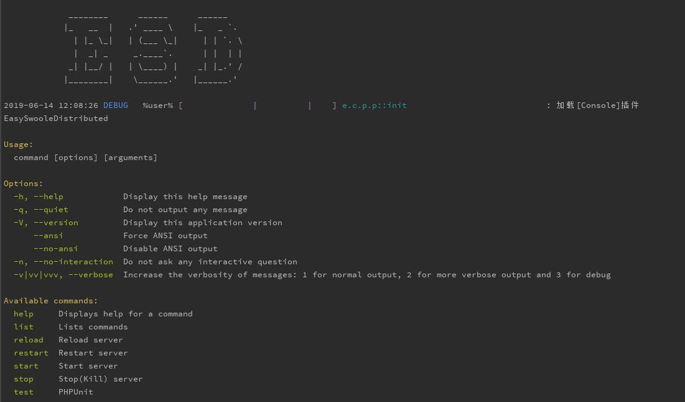
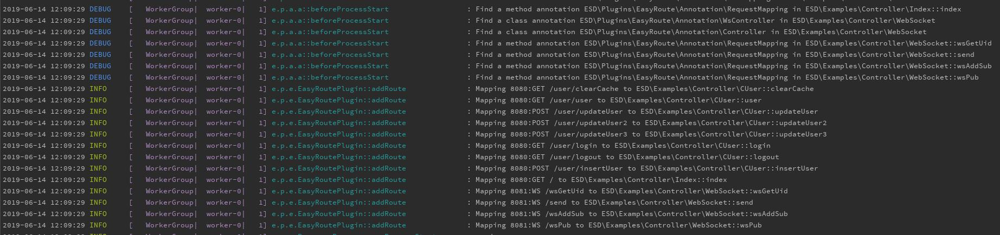
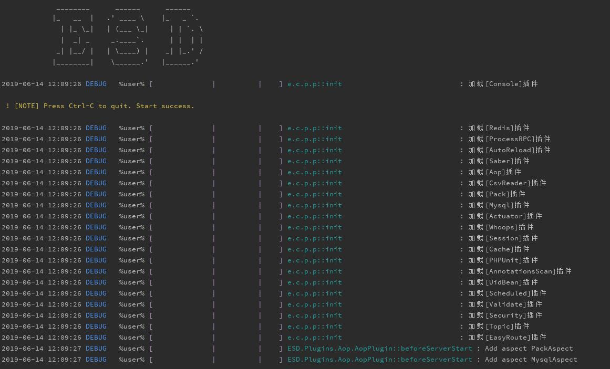
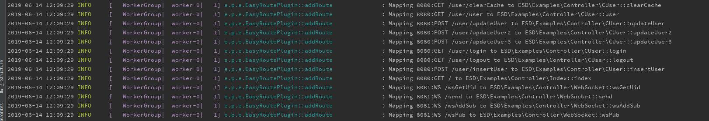
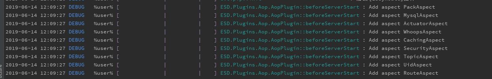
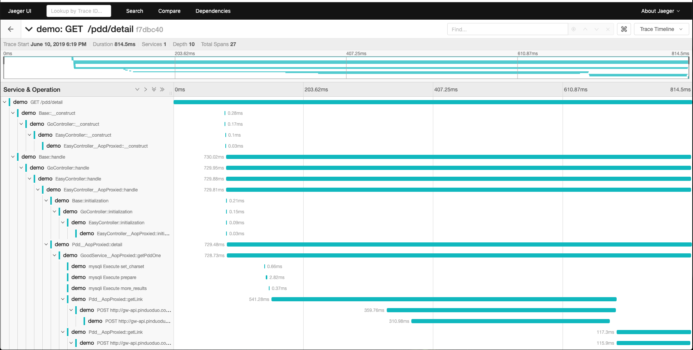

#  EasySwooleDistributed

**简单，易用，高性能，高扩展性，拥有强大的插件管理和丰富的插件系统，高颜值的PHP协程框架，简称ESD。**

由SwooleDistributed与EasySwoole合作打造最棒的swoole框架。


交流群：994811283


## ✨ 文档地址
https://www.kancloud.cn/tmtbe/goswoole/1067764
## ✨ 日志系统

类似SpringBoot的日志系统，更加清楚的日志展现。

## ⚡️ 插件系统

丰富插件库，目前收录了接近30个插件，通过加载组装不同的插件提供更强大的功能。
```php
$this->addPlug(new EasyRoutePlugin());
$this->addPlug(new ScheduledPlugin());
$this->addPlug(new RedisPlugin());
$this->addPlug(new MysqlPlugin());
$this->addPlug(new AutoreloadPlugin());
$this->addPlug(new AopPlugin());
```
加载插件只需要一行代码

## ⚡️ DI与注解
支持注解，框架提供大量可使用的注解，比如注解路由，注解事务，注解缓存，注解验证等。

```php
/**
 * @RestController("user")
 * Class CUser
 * @package ESD\Examples\Controller
 */
class CUser extends Base
{
    /**
     * @Inject()
     * @var UserService
     */
    private $userService;

    /**
     * @GetMapping("login")
     * @return string
     */
    public function login()
    {
    }
}
```
注解不是强制使用的，完全可以不使用注解。框架均提供了常规使用方式。
## ⚡️ AOP
完整支持面向切片编程。
```php
$this->addAspect(new MyAspect);
```

```php
/**
 * @param MethodInvocation $invocation Invocation
 *
 * @Around("@execution(ESD\Plugins\Mysql\Annotation\Transactional)")
 * @return mixed
 * @throws \Throwable
 */
public function aroundTransactional(MethodInvocation $invocation)
```

## Tracing 链路追踪
通过加载Tracing插件可以实现服务链路性能的监控,支持微服务

## ⚡️ 分布式与微服务
提供分布式与微服务的插件组织：

https://github.com/esd-cloud

## 目前收录的插件
* console-plugin https://github.com/esd-projects/console-plugin 控制台插件
* postgresql-plugin https://github.com/esd-projects/postgresql-plugin postgreSQL插件（由bearlord提供）
* mqtt-plugin https://github.com/esd-projects/mqtt-plugin MQTT服务器、MQTT客户端、MQTT路由
* redis-plugin https://github.com/esd-projects/redis-plugin redis插件
* easyroute-plugin https://github.com/esd-projects/easyroute-plugin 最方便的注解路由插件
* pack-plugin https://github.com/esd-projects/pack-plugin tcp，ws等自定义协议解析的pack插件
* tracing-plugin https://github.com/esd-projects/tracing-plugin 链路监控插件
* aop-plugin https://github.com/esd-projects/aop-plugin 提供AOP支持的插件
* amqp-plugin https://github.com/esd-projects/amqp-plugin AMQP插件（由李丹阳提供）
* mysql-plugin https://github.com/esd-projects/mysql-plugin mysql插件
* annotations-scan-plugin https://github.com/esd-projects/annotations-scan-plugin 扫描注解插件
* whoops-plugin https://github.com/esd-projects/whoops-plugin whoops插件，http调试用
* session-plugin https://github.com/esd-projects/session-plugin session插件
* cache-plugin https://github.com/esd-projects/cache-plugin cache插件,缓存
* actuator-plugin https://github.com/esd-projects/actuator-plugin actuator插件提供健康检查等框架默认端点服务
* security-plugin https://github.com/esd-projects/security-plugin 鉴权插件
* saber-plugin https://github.com/esd-projects/saber-plugin http客户端插件，Saber
* autoreload-plugin https://github.com/esd-projects/autoreload-plugin 自动reload插件，用于开发
* validate-plugin https://github.com/esd-projects/validate-plugin 验证插件，提供数据的验证
* uid-plugin https://github.com/esd-projects/uid-plugin uid插件，长连接用于绑定fd与uid的关系
* topic-plugin https://github.com/esd-projects/topic-plugin 主题插件，长连接用于发送订阅主题，符合MQTT规范
* scheduled-plugin https://github.com/esd-projects/scheduled-plugin 定时任务插件
* phpunit-plugin https://github.com/esd-projects/phpunit-plugin 单元测试插件
* blade-plugin https://github.com/esd-projects/blade-plugin blade渲染插件
* csvreader-plugin https://github.com/esd-projects/csvreader-plugin 读取解析csv的插件
* process-rpc-plugin https://github.com/esd-projects/process-rpc-plugin 进程通讯插件
* saber-cloud-plugin https://github.com/esd-projects/saber-cloud-plugin 声明试Web客户端，提供微服务访问
* circuitbreaker-plugin https://github.com/esd-projects/circuitbreaker-plugin 微服务的熔断器插件
* consul-plugin-plugin https://github.com/esd-projects/consul-plugin consul插件，提供服务注册，选举

## Docker运行环境(由anythink提供)
```
➜ docker run -it --rm -p 8080:8080 -v $PWD:/data registry.cn-beijing.aliyuncs.com/anythink/esd:latest
 _____ ____  ____    ____              _   _
| ____/ ___||  _ \  |  _ \ _   _ _ __ | |_(_)_ __ ___   ___
|  _| \___ \| | | | | |_) | | | | '_ \| __| | '_ ` _ \ / _ \
| |___ ___) | |_| | |  _ <| |_| | | | | |_| | | | | | |  __/
|_____|____/|____/  |_| \_\\__,_|_| |_|\__|_|_| |_| |_|\___|
ESD framework Runtime Environment
version 1.5 author by anythink
root@f41132062911:/data# 
```
docker run -it --rm -p 8080:8080 -v $PWD:/data registry.cn-beijing.aliyuncs.com/anythink/esd:latest

请在 ESD 根目录运行容器，否则修改$PWD为代码根路径（windows需要用%cd%替换$PWD），如果修改了端口请把8080 修改为自己使用的端口.
镜像启动后的目录即挂载到主机的代码目录，注意 Mac 系统无法使用 inotify 热加载功能。
容器启动后按照安装步骤，运行框架。

## 🍭 性能测试
 4核8G SSD盘 腾讯云高IO型I2服务器压测,框架压测包含路由
 
worker_num = 4

swoole  ab压测输出hello 平均 5.9QPS万 

ESD框架 ab压测输出hello 平均 3.6QPS万 

SD框架  ab压测输出hello 平均 1.3QPS万 

压测数据来自：A-Smile

## 🖊️ 如何贡献

非常欢迎您对ESD的开发作出贡献！

你可以选择以下方式向ESD贡献：

- [发布issue进行问题反馈和建议](https://github.com/esd-projects/esd-server/issues)
- 通过Pull Request提交修复
- 完善我们的文档和例子
- 提供更多的插件


## 📃 开源协议

Apache License Version 2.0 see http://www.apache.org/licenses/LICENSE-2.0.html